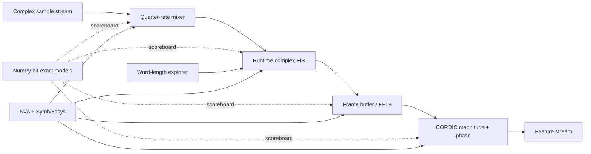
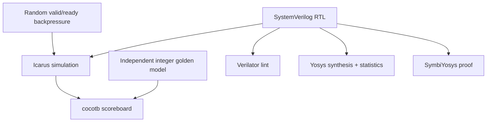

# ForgeDSP

[](https://github.com/Jimmy-Xi/forgedsp/actions/workflows/ci.yml)
[](LICENSE)
[](rtl/)

**A formally checked AXI-Stream-style fixed-point DSP accelerator library with bit-exact Python models and automated word-length exploration.**

ForgeDSP implements the hardware-side blocks needed to move a communications algorithm from NumPy into RTL: quarter-rate complex downconversion, a runtime-programmable complex FIR, an iterative Radix-2 FFT, CORDIC magnitude/phase conversion and a formally checked elastic stream buffer.

The project is verification-first. Every arithmetic block has an independent integer reference model; cocotb compares RTL outputs to those models, randomized backpressure exercises `ready/valid`, SymbiYosys proves stream-stability properties, and Yosys synthesizes every module in CI.

## Portfolio role

```text
WavePilot  — communication algorithm and OFDM link
ForgeDSP   — fixed-point RTL acceleration and verification
PulseForge — Linux driver, buffering and userspace collection
```

Together they demonstrate algorithm design, hardware implementation and operating-system integration without requiring an FPGA board.

## Implemented RTL

| Module | Function | Architecture |
|---|---|---|
| `axis_quarter_rate_mixer` | Complex downconversion by `exp(-jπn/2)` | Multiplier-free four-phase rotation |
| `axis_complex_fir` | Complex samples, real runtime coefficients | Parameterized taps, widened accumulator, saturation |
| `fft8_stream` | Eight-point complex FFT | Bit-reversed input, three iterative Radix-2 stages, Q1.15 twiddles |
| `cordic_vector` | Cartesian to magnitude/phase | 16-cycle vectoring CORDIC with gain compensation |
| `axis_skid_buffer` | One-entry elastic buffer | Backpressure-safe registered stream boundary |

All data-plane interfaces follow the AXI4-Stream `valid/ready` contract: a transfer occurs only when both are high, and output payload remains stable while stalled. The FIR coefficient port is intentionally kept small and bus-neutral in v0.1; an AXI-Lite register frontend is on the roadmap.

## Architecture



The v0.1 blocks are individually reusable IP rather than one hard-wired top-level pipeline. This makes latency and buffering decisions explicit when integrating them into a real design.

## Quick start

Python models and word-length exploration need only NumPy:

```bash
python -m pip install -e .
python -m unittest discover -s tests/python -v
forgedsp-wordlength --max-evm 0.01 --top 5
```

With Icarus Verilog, cocotb, Yosys and SymbiYosys installed:

```bash
make rtl
make formal
make synth
```

GitHub Actions provisions the complete open-source RTL toolchain automatically through the YosysHQ OSS CAD Suite.

## Automated word-length search

The explorer generates a deterministic complex multitone, filters it in floating point, then evaluates integer configurations with the same truncation and saturation behavior as the RTL. Each candidate reports:

- data, coefficient and accumulator widths;
- RMS EVM against the floating-point reference;
- a transparent multiplier/register cost proxy;
- whether it satisfies the requested EVM constraint.

Reference 8-tap result for `max_evm=1%`:

| Data | Coefficient | Accumulator | RMS EVM | Cost proxy |
|---:|---:|---:|---:|---:|
| 10 bits | 8 bits | 21 bits | 0.679% | 808 |
| 12 bits | 8 bits | 23 bits | 0.224% | 952 |
| 10 bits | 10 bits | 23 bits | 0.728% | 984 |

The first row is the minimum-cost configuration among the scanned even widths from 8 to 18 bits that meets 1% EVM. The cost is a comparison proxy, not a vendor FPGA LUT/DSP count.

## Verification strategy



Checks include:

- exact mixer phase sequence under randomized output stalls;
- FIR impulse response, coefficient programming, accumulator scaling and saturation;
- all eight FFT bins, natural output order and `last` framing under backpressure;
- CORDIC magnitude/phase in all four quadrants;
- formal proof that a stalled stream output remains valid and bit-stable;
- Python checks against NumPy FFT and floating-point magnitude/phase.

See [`docs/verification.md`](docs/verification.md) for property boundaries and test intent.

## Fixed-point conventions

- Samples are signed two's-complement integers, 16 bits by default.
- FIR coefficients default to Q1.15.
- FIR accumulation widens by coefficient width plus `ceil(log2(taps))` before truncation and saturation.
- FFT twiddles use Q1.15; the internal datapath grows by three bits for an unscaled eight-point transform.
- CORDIC phase is signed, with `π` represented near `+32767` and `-π` as `-32768` for a 16-bit phase word.

## Repository map

```text
rtl/             synthesizable SystemVerilog IP
src/             bit-exact Python arithmetic and width search
tests/python/    mathematical/reference-model tests
tests/cocotb/    RTL scoreboards and backpressure tests
formal/          SymbiYosys harness and proof configuration
scripts/         synthesis helpers
docs/            architecture, verification, roadmap and resume notes
```

## Roadmap

Next steps include AXI-Lite coefficient/control registers, longer parameterized streaming FFTs, FIFO composition, vendor-independent RAM inference, rounding-mode selection, cross-module latency metadata, FPGA place-and-route results and integration with WavePilot/PulseForge. See [`docs/roadmap.md`](docs/roadmap.md).

## Resume material

Verified Chinese and English bullet templates are in [`docs/resume.md`](docs/resume.md). Do not claim FPGA frequency, power or LUT/DSP utilization until a named target device has completed place-and-route.

## License

MIT.

